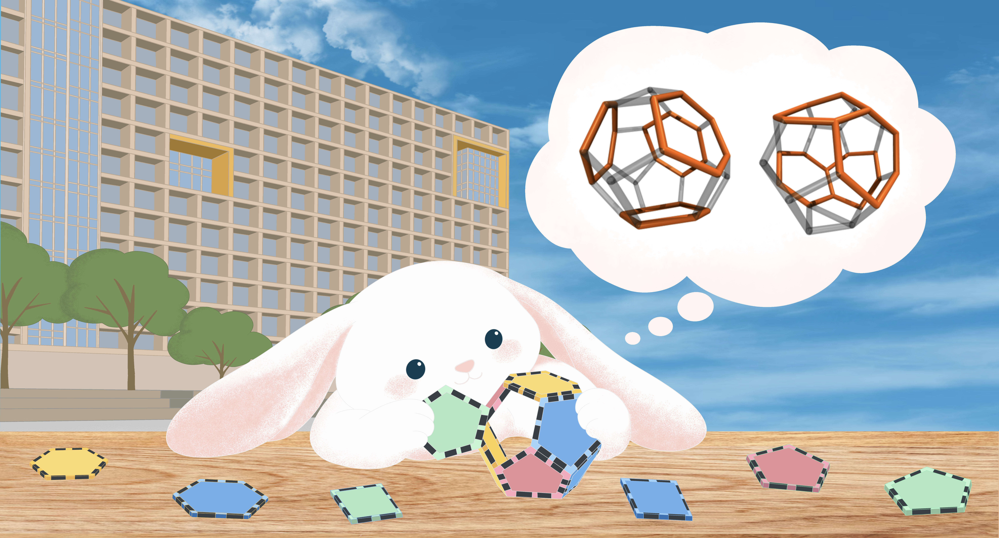

<p align="center">
  
</p>

# SQQ

**SQQ (Shell Quant Qualifier): Python Joint Toolkit for Water-Shell Topology Analysis.**

Current release version: **0.5.7** (Sep 25, 2026; Mid-Autumn Day)

SQQ identifies water-network rings, cages, hydrate phases, guest occupancy, order parameters, and persistent cage tracks from molecular-dynamics structures and trajectories. It provides the complete SQQ-Py workflow and a focused native SQQ-CPP cage engine.

Detailed definitions are in [docs/design.md](docs/design.md); release history is in [docs/update.md](docs/update.md).

## Changed in 0.5.7

- Reduced memory use for long trajectories and large Track runs.
- Faster render output, imported-result validation, and tracking of selected cages.
- Clearer progress and warnings, with unchanged scientific results for the same input.

See [Version 0.5.7](docs/update.md#version-057) for complete release notes.

## Acknowledgements

Names are listed alphabetically by family name.

- Cao, Pinqiang @ Wuhan University of Science and Technology
- Cheng, Liwei @ Wuhan Institute of Technology
- Fang, Bin @ Hainan University
- Hu, Yifei @ Fuzhou University
- Jia, Jihui @ China University of Petroleum (Beijing)
- Li, Wuquan @ Beijing Huairou Laboratory
- Li, Zhenchao @ Fuzhou University
- Liao, Bo @ China University of Petroleum (East China)
- Lu, Yingxu @ Wuhan Institute of Technology
- Mi, Fengyi @ Southwest University of Science and Technology
- Sun, Yingtao @ The Hong Kong University of Science and Technology
- Xu, Hongye @ The University of Tokyo
- Zhang, Zhengcai @ Laoshan Laboratory
- Zhao, Jingyuan @ Akatsuki Games Inc.

## Installation & Update

```bash
pip install sqq
pip install --update sqq
```

For local development:

```bash
pip install -e .
python -m sqq -h
```

Source builds require Python 3.10+, CMake 3.20+, a C++17 compiler, Python development headers, and a platform build tool. Released wheels normally include the native extension. A first invocation may take a few extra seconds while dependencies create a Matplotlib font cache.

```bash
sqq --version
sqq -h
```

## Quick Start

The default `py` engine analyzes the water network, 4/5/6-membered rings and cages, F3/F4, writes per-frame information, creates a VMD package, and produces `summary.xlsx`.

### Configuration

```bash
sqq init
sqq analyze -i test.gro -c sqq_config.yaml -o ./result_sqq
```

`sqq init` writes a commented `sqq_config.yaml` and refuses to overwrite it. SQQ does not auto-load this file: use `-c` explicitly, or omit `-c` to use built-in defaults.

### Structures and trajectories

```bash
# One GRO structure
sqq analyze -i test.gro -o ./result_sqq

# A directory or glob of structures
sqq analyze -i ./gro -o ./result_sqq
sqq analyze -i "./gro/*.gro" -o ./result_sqq

# XTC/TRR plus topology; sample every 100 ps
sqq analyze -i traj.xtc -t topol.gro -dt 100 -o ./result_sqq

# Repeated complete GRO frames
sqq analyze -i frames.gro -dt 100 -o ./result_sqq

# LAMMPS dump/DCD plus DATA topology
sqq analyze -i traj.lammpstrj -t system.data -o ./result_sqq
```

Without `-dt`, every stored frame is analyzed. Compatible GRO files share one result root; incompatible topologies are separated into `result_A`, `result_B`, and so on.

### Engines, workers, and explicit pairs

```bash
sqq analyze -i ./gro -e py -w 4 -o ./result_py
sqq analyze -i traj.xtc -t topol.gro -e cpp -w 50% -o ./result_cpp
sqq analyze -i test.gro -b pairs --pair water_pairs.txt -o ./result_pairs
```

Use `py` for the complete workflow and `cpp` for the focused native cage workflow. Integer worker values are counts; decimals and percentages are physical-core fractions.

### Track cages

```bash
# Reuse an Analyze result
sqq track --source ./result_sqq --target all -o ./result_track

# Or track directly from a trajectory
sqq track -i traj.xtc -t topol.gro -dt 100 --target 512,t133 -o ./result_track
```

Track targets may be `all`, cage types, hydrate phases, or persistent IDs such as `t133`.

### Visualize results

```bash
# Validate render files and print absolute VMD commands
sqq vmd ./result_sqq
```

## Engines and Inputs

Values `00` and `99` are compatibility presets, not points on a continuous scale. The default is `py`.

| Value | Backend | Graph | Workers | Cluster | Default outputs |
| --- | --- | --- | ---: | --- | --- |
| `00` | SQQ-Py | `hbond` | 100% | on | `info,sqq-render,summary-xlsx` |
| `py` | SQQ-Py | `auto` | 1 | off | `info,sqq-render,summary-xlsx` |
| `99` | SQQ-CPP | `hbond` | 100% | unsupported | `info,sqq-render,summary-csv,summary-detail-csv` |
| `cpp` | SQQ-CPP | `auto` | 1 | unsupported | `info,sqq-render,summary-csv,summary-detail-csv` |

SQQ-Py provides the complete graph/ring/half/quasi/cage/cluster/phase/ice/order-parameter workflow. SQQ-CPP provides native graph construction, internal chordless 4/5/6 rings, cage/isomer/occupancy, and F3/F4. Native errors never silently fall back to Python.

| Input | Required topology | Key rule |
| --- | --- | --- |
| GRO or stacked GRO | none | Coordinates are normalized in nm |
| Directory/glob of GRO | optional shared GRO | Compatible GRO systems are grouped |
| XYZ or directory/glob of XYZ | none | Default scale `0.1`; no periodic box |
| XTC/TRR | `-t topol.gro` | Physical time and box are retained |
| LAMMPS dump/DCD | `-t system.data` | DATA defines atoms, bonds, and components |

Only orthorhombic periodic boxes are supported. LAMMPS can infer common water and methane components; explicit type/role mappings take priority. Walls, surfactants, additives, and other retained components do not enter the water graph unless classified as water. See [Input Validation and Coordinate Units](docs/design.md#input-validation-and-coordinate-units).

## CLI Reference

| Option | Purpose |
| --- | --- |
| `-i, --input INPUT` | Input file, directory, or glob |
| `-t, --top FILE` | GRO topology or LAMMPS DATA |
| `-c, --config FILE` | Explicit YAML/JSON configuration |
| `-o, --output DIR` | Output directory; default `result_sqq` |
| `-e, --engine VALUE` | `00`, `py`, `99`, or `cpp` |
| `-w, --worker VALUE` | `auto`, count, fraction, or percentage |
| `-dt, --delta-time PS` | Exact physical sampling interval |
| `-b, --bond-mode MODE` | `auto`, `hbond`, `oo`, or `pairs` |
| `-s, --size SIZES` | Ring/quasi search sizes |
| `--find-half on|off` | Override half-cage search |
| `--find-quasi on|off` | Override quasi-cage search |
| `--find-cluster on|off` | Override hydrate-cluster search |
| `--order-parameter NAMES` | `f3`, `f4`, `qN`, `mcg1`, `mcg3`, `dhop35`, `dhop30`, `all`, or `none` |
| `--pair FILE` | Explicit water-network edge file |
| `--output-type TYPES` | Replace Analyze outputs; `default` may be extended |
| `-h, --help` | Show help |

`--pair` implies pairs mode unless `-b pairs` is already present; it conflicts with an explicit non-pairs mode. CLI-relative pair paths resolve from the working directory, while YAML-relative paths resolve from the configuration directory. Expected user-facing failures print one concise `Error: ...`; `SQQ_DEBUG=1` enables development tracebacks. Full CLI and migration rules are in [Analysis Engines and Workers](docs/design.md#analysis-engines-and-workers).

## Configuration

Precedence is:

```text
built-in defaults -> engine preset -> sqq_config.yaml -> retained CLI overrides
```

A compact configuration is:

```yaml
engine: py
water:
  resname: [SOL, TIP, WAT, HOH]
guest:
  resname: [CH4, CO2, MET, ETH]
additive:
  resname: []
environment:
  resname: []
graph:
  mode: auto
ring:
  size: [4, 5, 6]
  report_size: auto
half_cage:
  enabled: auto
quasi_cage:
  enabled: auto
  max_layer: 1
cage:
  report_type: auto
  scientific_validation: false
hydrate_cluster:
  enabled: false
order_parameter:
  enabled: [f3, f4]
output:
  type: [info, sqq-render, summary-xlsx]
render:
  atom_scope: full
track:
  target: all
  gap_frame: 0
  max_gap_ps: null
```

The generated YAML contains every key, default, unit, and choice. Unknown or duplicate keys are errors; supported older spellings migrate with a warning. Every run writes effective settings, provenance, failures, timing, and outputs to `sqq_config_resolved.yaml`. See the complete [Configuration Reference](docs/design.md#configuration-reference).

## Scientific Scope

SQQ builds an `hbond`, `oo`, or explicit-pair water graph; finds rings and half/quasi cages; validates closed-cage topology; assigns guest occupancy; and optionally classifies hydrate domains, ice-like water, F3/F4, Q_l, MCG, and DHOP. Search and report scopes are separate. Diagnostic cage-state limits abort a frame instead of publishing partial cage results. Optional geometry validation may remove distorted cages and consequently change occupancy or cluster output. Exact definitions are in [docs/design.md](docs/design.md).

## Tracking

`sqq track` assigns persistent `t1`, `t2`, ... IDs from stable water identities and deterministic cage matching.

| Target | Selection | Directory |
| --- | --- | --- |
| `all` | Every cage | `all/` |
| `512,51264` | Tracks that ever match each type | `type_512/`, `type_51264/` |
| `sI,sII,sH` | Tracks in each phase | `phase_sI/`, etc. |
| `t133` | One persistent lifecycle | `cage_t133/` |

Mixed targets are written independently, and type/phase targets retain complete selected lifecycles. Phase targets require SQQ-Py cluster labels; imported state cannot create missing labels retroactively. A target that matches no cage is still written (empty tables, render package without selections) and is named in the final `Warnings` row.

Matching remains water-shell-first; guest exchange does not create a cage ID. Each continuation is checked against the track's most recently observed shell, so gradual water exchange can preserve an ID while every adjacent or gap-bounding pair still passes the configured thresholds even after overlap with the initial shell reaches zero. Version 0.5.6 diagnostics and derived statistics do not change the default `tID` assignment. Raw Track is currently serial and is required for pre-cage precursor history; since 0.5.7 that history is reconstructed from compact per-frame records spooled during the single analysis pass, so the prefix is not analyzed twice.

Raw Track validates the final effective time of every selected frame before analysis, including configured fallback times for frames without stored time. Times may be irregular or equal but cannot decrease; physical gaps and duration statistics use those actual times, while `gap_frame` remains a selected-frame count. Analyze keeps valid per-frame scientific output if snapshot reduction is unsuitable, but omits that topology group's persistent Track state with a warning. Schema 2/3 state can recover partial diagnostics from archived thresholds; schema 1 retains its raw evidence without inventing threshold-dependent classifications.

Only directly consecutive observations produce resolved type, phase, guest, or occupancy changes. A change across a permitted recognition gap is recorded as unresolved, and affected residence segments remain gap-censored lower bounds. Split/merge confirmation additionally requires persistent destination shells and independent branch-water contributions; overlap between already persistent neighboring cages is retained only as non-confirmable candidate evidence.

```text
result_track/track/
  track_state.json
  {cage_observation,cage_track,cage_event,cage_population}.csv
  {guest_residence,lifetime_distribution}.csv
  statistics/{tracking_quality,lifetime_survival,cage_lineage,...}.csv
  network/{cage_transition_nodes,cage_transition_edges}.csv
  <target>/
    filtered tables and statistics
    precursor_state.csv, water_history.csv       # persistent-ID target; source may report unavailable
    sqq_render/{sqq_track.gro,sqq_track.xtc,
                sqq_track.membership.tsv,sqq_track.vmd.tcl}
```

See [Cross-Frame Cage Tracking](docs/design.md#cross-frame-cage-tracking) for exact matching, duration, event, network, and source/raw definitions.

Track target GRO/XTC files may be hard-linked to avoid duplicate trajectory data. Treat them as immutable SQQ output: deleting or atomically replacing one path is safe, but editing a hard-linked file in place can also alter a sibling target package.

New Analyze state binds its matching configuration and complete render package to topology, component, atom, cage, selected-frame/time, and SHA-256 provenance; the digests are taken while the package is written. `sqq track --source` re-hashes and validates those records before publishing any target result; older states remain readable through structural validation.

Track workflow memory is bounded by active/dormant matching state rather than the complete observation history: observations and events use a run-private disk spool, the JSON state and observation-level tables are streamed record by record, and per-target tables reuse the run-level rows. The public in-memory tracking API remains available for programmatic use. The release gate includes a real 1.417 GB / 1,001-frame LAMMPS run plus exact SQQ-Py/SQQ-CPP Track-output comparisons; no scientific tolerance is widened for these optimizations.

## Outputs

| Type | Result |
| --- | --- |
| `default` / `all` / `none` | Engine defaults / all currently applicable outputs / no optional output |
| `info` | Per-frame Markdown |
| `sqq-render` | Indivisible GRO/XTC/membership-TSV/Tcl package |
| `summary-xlsx` / `summary-csv` | Main workbook / CSV tables |
| `summary-detail-csv` | Cage occupancy/isomer details; Py also adds quasi isomers |
| `cluster-detail` | Hydrate domain and cluster CSVs; SQQ-Py |
| `membership-tsv` / `order-tsv` | Per-water membership or selected F3/F4/Q_l; SQQ-Py |
| `f3-gro` / `f4-gro` | Complete valid waters with oxygen values annotated |
| `gro` / `cage-gro` | Engine-specific classified structures / cage structures |
| `ring-gro`, `half-gro`, `quasi-gro`, `ice-gro` | SQQ-Py category structures |
| `cluster-gro` | sI/sII/sH/boundary structures; SQQ-Py with cluster search |

`default,summary-detail-csv` extends the engine default. `all` and `none` are exclusive. Track output is fixed and cannot be reduced with `--output-type`.

```text
result_sqq/
  sqq_config_resolved.yaml
  sqq_output_manifest.json
  summary.xlsx and/or summary/
  info/frame_*_info.md
  gro/<frame>/                         # selected structures
  sqq_render/
    sqq_cage.gro
    sqq_cage.xtc
    sqq_cage.membership.tsv
    sqq_cage.vmd.tcl
  track/
    track_state.json
    compatibility tables
    statistics/
    network/
```

A single GRO/XYZ may use a compact frame-root layout. Incompatible topologies use complete `result_A` through `result_Z` roots; larger heterogeneous sets use an information-only safety layout. Main summaries contain the applicable graph, ring, cage, cluster, ice, and order tables; selected detail output adds occupancy and isomer tables. SQQ-CPP writes its applicable subset. With `all`, cluster outputs still require cluster search.

All successful Analyze sequences write persistent Track state independently of `sqq-render`. If a requested output directory is nonempty, SQQ preserves it and selects `_001`, `_002`, and so on. Outputs are staged and atomically published. See [Output Layout](docs/design.md#output-layout) for complete files and schemas.

## VMD

Keep all four `sqq_render/` files together. Use `sqq vmd RESULT` to validate them and print absolute commands, or source the Tcl script directly:

```tcl
source {path/to/result_sqq/sqq_render/sqq_cage.vmd.tcl}
```

```text
sqq show <family> <target...> [<family> <target...>]...
sqq color <family> <target...> <VMD-color|ColorID|default>
sqq show label [on|off]
sqq pick center|guest|off
sqq target save
sqq clear
sqq help | sqq -h | sqq --help
```

Families are `cage`, `guest`, `phase`, `cluster`, `domain`, and `component`. For example:

```tcl
sqq show cage 512 guest 512
sqq show phase sI component environment
sqq color cage 512 green
sqq pick center
sqq target save
```

The default is opaque `cage all` with context hidden. Picking makes unselected objects transparent, highlights cages in yellow and guests in orange, and leaves labels off. DynamicBonds style changes persist across earlier and later frames; explicit SQQ style/reset commands may intentionally replace them. Full picking, color, target-validation, and representation rules are in [Output Layout](docs/design.md#output-layout).

## Citation Recommendation

Cages were identified and analyzed using SQQ.<br>
Publication: J. PANG & Q. SUN. SQQ: Python Joint Toolkit for Water-Shell Topology Analysis. *Journal of Physical Chemistry A*.<br>
DOI: [http://doi.org/10.1021/acs.jpca.6c05769](http://doi.org/10.1021/acs.jpca.6c05769)<br>
GitHub: [https://github.com/pimooni/sqq](https://github.com/pimooni/sqq)

## Python API

```python
from sqq import analyze_frame, load_config, read_frames

config = load_config({"graph": {"mode": "oo"}}, engine="py")
frame = next(read_frames("frame.gro", config=config))
result = analyze_frame(frame, config)
```

These public functions use the same readers, configuration resolution, validation, and engines as the CLI. They return immutable resolved configuration, `Frame`, and `FrameResult` objects and raise typed SQQ exceptions. `sqq.api` and `sqq.models` are the stable import surfaces; workflow, runtime, and I/O module paths are implementation details and may move between releases. Track record classes in `sqq.models` are slotted immutable dataclasses: use `dataclasses.fields`/`dataclasses.asdict` for generic inspection rather than `vars()` or weak references. Their name-based pickle state remains readable from 0.5.6.

## Current Limits

- Periodic geometry is orthorhombic; triclinic input must be converted first.
- XYZ has configurable scaling but no periodic box.
- Closed cages use 4/5/6 faces; 7-member rings remain available to ring/quasi analysis.
- SQQ-CPP omits public ring, half/quasi, cluster/phase, ice, Q_l/MCG/DHOP, and related category output.
- Domain/cluster IDs are frame-local; Track assigns persistent IDs to cages, not grains.
- Source Track cannot reconstruct pre-cage history; use raw Track when required. A Track result is not itself a valid `--source`.
- Raw Track accepts one physical trajectory or stacked GRO system; select incompatible Analyze groups separately.
- Exit status is 0 for a completed run (even with some failed non-strict frames), 1 when every requested frame failed, and 2 for configuration, input, or runtime errors.

## Documentation

- [Complete design and reference](docs/design.md)
- [Release notes](docs/update.md)
- `sqq analyze -h` — Analyze options
- `sqq track -h` — Track targets and inputs
- `sqq vmd -h` — VMD locator and Tcl commands
- `sqq init` — complete commented configuration
